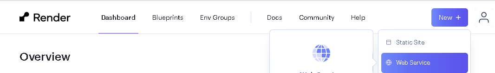
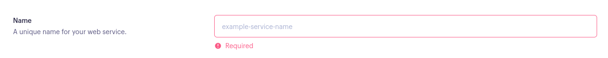
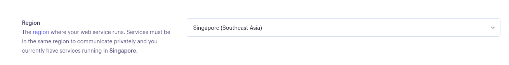
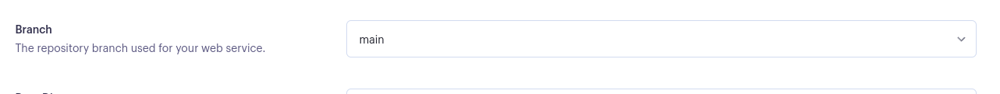
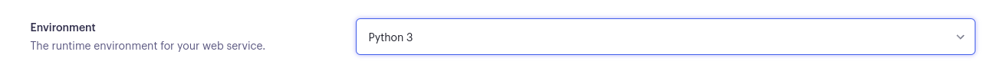
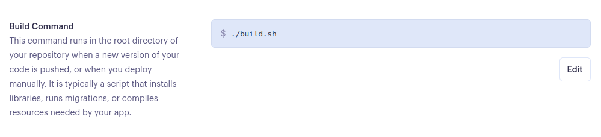
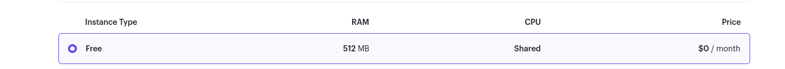
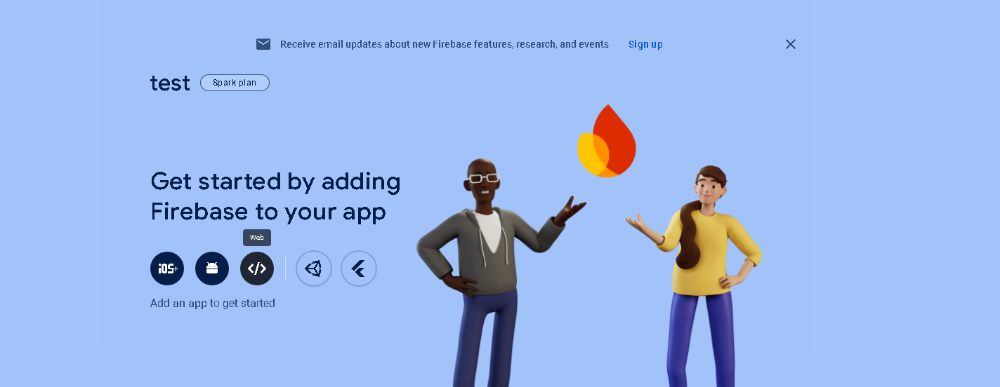
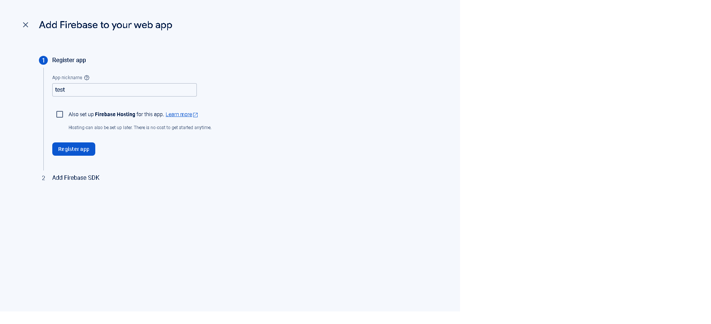
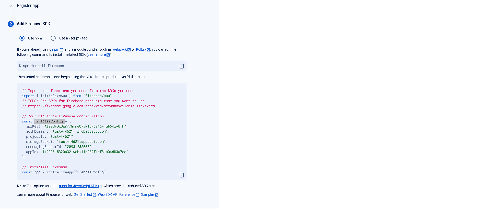

# Deployment

## Render Deployment (Backend)

### Create a new app on Render

1.  Create a new Render account if you don't already have one here [Render](https://render.com/).

2.  Create a new application on the following page here [New Render App](https://dashboard.render.com/), choose **Webserver**:

    - 

3.  Search for the repository you created and click "Connect."

4.  Create name for the application

    - 

5.  Select the region where you want to deploy the application.

    - 

6.  Select branch to deploy.

    - 

7.  Select environment.

    - 

8.  Render build command: `gunicorn app:app`

    - 

9.  Select Free plan.

    - 

10. Click "Create Web Service."

    - 

---

## Firebase Deployment (Frontend)

1. Go to [Firebase](https://firebase.google.com/) and create a new account.

2. Create a new project:

   - 

3. Name your project

4. Add an app to your project by clicking on Web button

   - 

5. Name and register the app

   - 

6. Install firebase package by running `npm install firebase` in the directory

7. Create a file for the config and paste the data for the app

   - 

8. Install firebase tools by running `npm install firebase-tools` in the directory

9. Build your app by running `npm run build`.

10. Initialize Firebase by running `firebase init` in the directory.

11. Deploy the app by running `firebase deploy`
