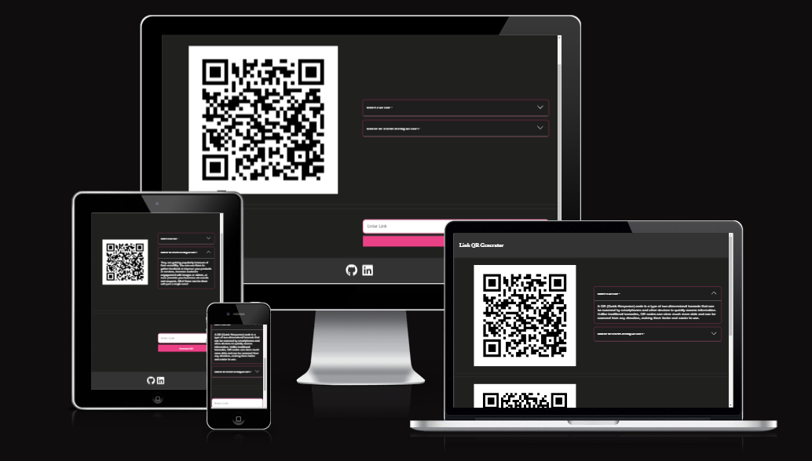
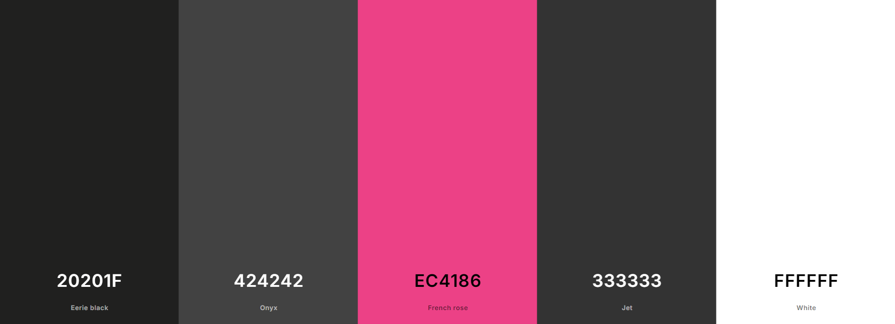

# Link QR Generator

**Deployed website: [Link to website](https://link-qr-generator.web.app/)**

## About

Link QR Generator is a website that allows users to generate QR-Codes for the link the user inserts, The webiste also allows the QR-Code image to be downloaded for further privat usage.

---

## UX

The website was created to be eye-catching and user-friendly. THe user is able to generate a QR-Code image by pasting a valid link and clicking on the generate button. The user is also able to download the generated image for further usage.

### Target Audience

This website is intended for people interested in generating QR-Codes that leads to their websites for personal usage.

---

## Future Development

#### Add the ability to generate a custom QR-Codes

Right now the QR-Codes generated are generic and basic. In the future i will add the ability to generate a custom QR-Code or more customisable codes.

---

## Technologies used

- ### Languages:

  - [Python 3.8.5](https://www.python.org/downloads/release/python-385/): the primary language used to develop the server-side of the website.
  - [HTML](https://developer.mozilla.org/en-US/docs/Web/HTML): the markup language used to create the website.
  - [Styled Components](https://styled-components.com/): the styling used to style the elements of the website.
  - [CSS](https://developer.mozilla.org/en-US/docs/Web/css): the styling language used to style the website.

- ### Frameworks and libraries:

  - [React](https://react.dev/): react framework was used to create all the frontend components.
  - [Flask](https://flask.palletsprojects.com/en/stable/): python framework used to create all the logic for the Backend requests.

- ### Other tools:

  - [Git](https://git-scm.com/): the version control system used to manage the code.
  - [Pip3](https://pypi.org/project/pip/): the package manager used to install the dependencies.
  - [Gunicorn](https://gunicorn.org/): the web server used to run the website.
  - [GitHub](https://github.com/): used to host the website's source code.
  - [VSCode](https://code.visualstudio.com/): the IDE used to develop the website.
  - [Chrome DevTools](https://developer.chrome.com/docs/devtools/open/): was used to debug the website.
  - [W3C Validator](https://validator.w3.org/): was used to validate HTML5 code for the website.
  - [W3C CSS validator](https://jigsaw.w3.org/css-validator/): was used to validate CSS code for the website.
  - [PEP8](https://pep8.org/): was used to validate Python code for the website.

---

## Features

Please refer to the [FEATURES.md](FEATURES.md) file for highlighted features.

---

## Design

### Color Scheme

The main colors used in the application.

## Testing

Please refer to the [TESTING.md](TESTING.md) file for all test-related documentation.

---
